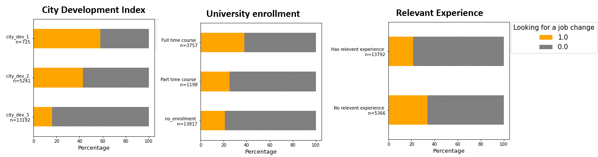
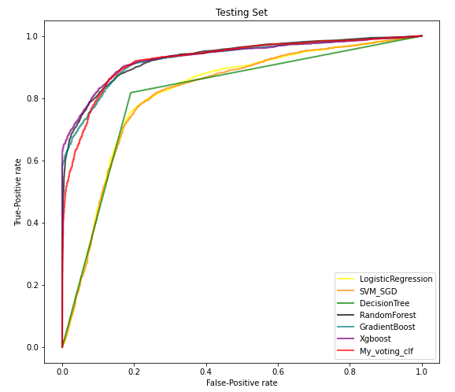
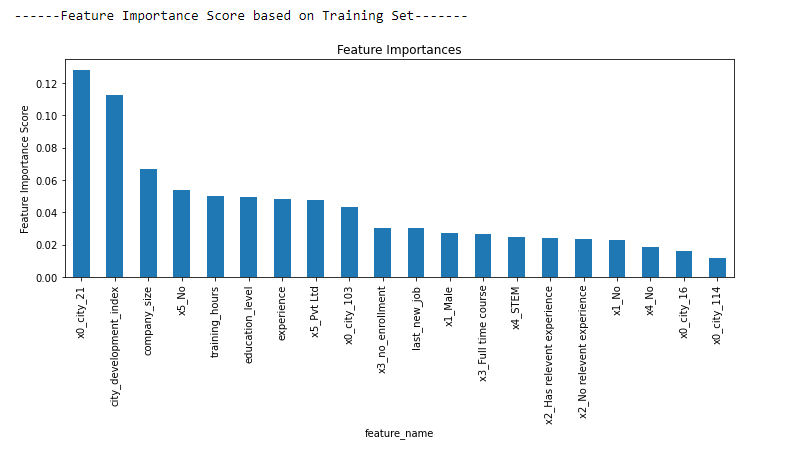

# HR Analytics: Predict who will move to a new job

Photo by <a href="https://unsplash.com/@saulomohana?utm_source=unsplash&utm_medium=referral&utm_content=creditCopyText">Saulo Mohana</a> on <a href="https://unsplash.com/s/photos/career?utm_source=unsplash&utm_medium=referral&utm_content=creditCopyText">Unsplash</a>
  

&nbsp;

### 0) Data Exploration and Visualization <a href = "https://nbviewer.jupyter.org/github/Wei-Kuang/HR_JobChange/blob/main/HR_Analysis_Step0_DataVisualization.ipynb">[code]</a> 

**Please visit the code for more data visualization and insight extraction.**

### 1) Data Preprocessing <a href = "https://nbviewer.jupyter.org/github/Wei-Kuang/HR_JobChange/blob/main/HR_Analysis_Step1_DataPreprocessing.ipynb">[code]</a>  

<ul><ul>
<li>Remove unneeded features.</li>
<li>Impute missing values.</li>
<li>Encode ordinal variables.</li>
<li>One hot encode for Nominal variable.</li>
<li>Impute minor outcome.</li>
<li>Split the dataset into train and test.</li>
<li>Then, standardize the numeric column based on train set.</li>
</ul></ul>

### 2) Model Selection <a href = "https://nbviewer.jupyter.org/github/Wei-Kuang/HR_JobChange/blob/main/HR_Analysis_Step2_ModelSelection.ipynb">[code]</a>

I explore seven models to predict the outcome: Logistic Regression, SVM_SGD, DecisionTree, Random Forest, Gradient Boost, Xgboost ,and My voting_clf (ensemble model).

 

#### Decision

By reviewing AUC score, the top 3 models are: **(1) Xgboost, (2) Random Forest, and (3) Gradient Boost.** I will tune parameters for these models using cross-validation and grid search.

&nbsp;

### 3) Performance of tuned RandomForest, Gradient Boost, and Xgboost

- **Default model:** The model using default hyper parameters.
- **Final model:** The model with tuned hyper parameters.

<a href = "https://nbviewer.jupyter.org/github/Wei-Kuang/HR_JobChange/blob/main/HR_Analysis_Step3_1_RandomForest_TuningParam.ipynb"> 3.1) Random Forest Model Tuning [code] </a>  <!DOCTYPE html>
<html>
<body>

<table style="width:100%">
  <tr>
    <th>Model</th>
    <th>Accuracy (testing set)</th> 
    <th>AUC score (testing set)</th>
  </tr>
  <tr>
    <td>Default</td>
    <td> 0.855 </td>
    <td> 0.9326 </td>
  </tr>
  <tr>
    <td> Final </td>
    <td> 0.860 </td>
    <td> 0.9370 </td>
  </tr>
  
</table>
</body>
</html>

<a href = "https://nbviewer.jupyter.org/github/Wei-Kuang/HR_JobChange/blob/main/HR_Analysis_Step3_2_GMB_TuningParam.ipynb"> 3.2) Gradient Boost Model Tuning [code]</a>  
<!DOCTYPE html>
<html>
<body>

<table style="width:100%">
  <tr>
    <th>Model</th>
    <th>Accuracy (testing set)</th> 
    <th>AUC score (testing set)</th>
  </tr>
  <tr>
    <td>Default</td>
    <td> 0.855 </td>
    <td> 0.9250 </td>
  </tr>
  <tr>
    <td> Final </td>
    <td> 0.859 </td>
    <td> 0.9361 </td>
  </tr>
  
</table>
</body>
</html>

<a href = "https://nbviewer.jupyter.org/github/Wei-Kuang/HR_JobChange/blob/main/HR_Analysis_Step3_3_XBG_TuningParam.ipynb"> 3.3) Xgboost Model Tuning [code]</a>  
<!DOCTYPE html>
<html>
<body>

<table style="width:100%">
  <tr>
    <th>Model</th>
    <th>Accuracy (testing set)</th> 
    <th>AUC score (testing set)</th>
  </tr>
  <tr>
    <td>Default</td>
    <td> 0.859 </td>
    <td> 0.9349 </td>
  </tr>
  <tr>
    <td> Final </td>
    <td> 0.862 </td>
    <td> 0.9368 </td>
  </tr>
  
</table>
</body>
</html>

&nbsp;

### 4) Feature importance - Random Forest (AUC testing = 0.937)
 

&nbsp;

### Reference

Dataset: https://www.kaggle.com/arashnic/hr-analytics-job-change-of-data-scientists
